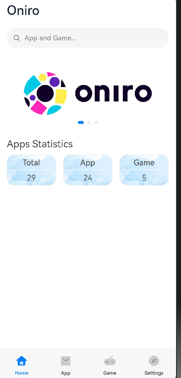
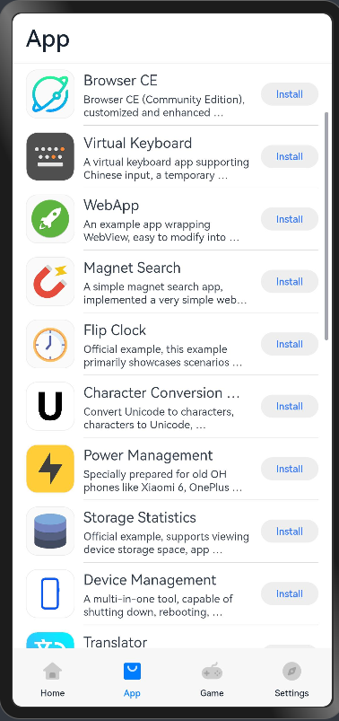
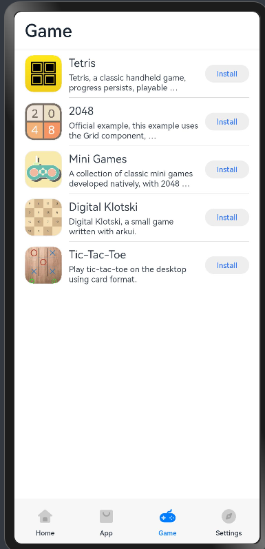
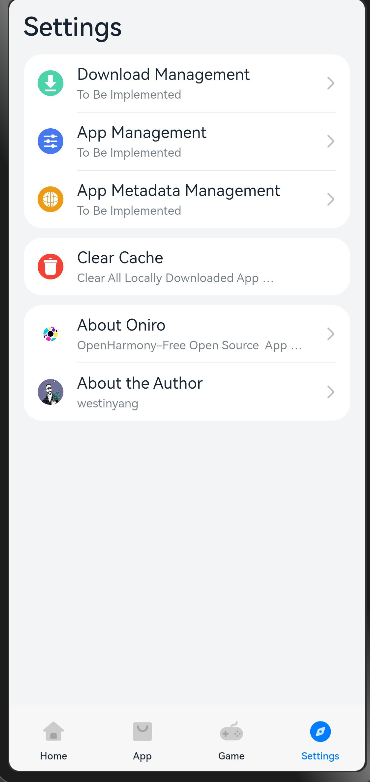
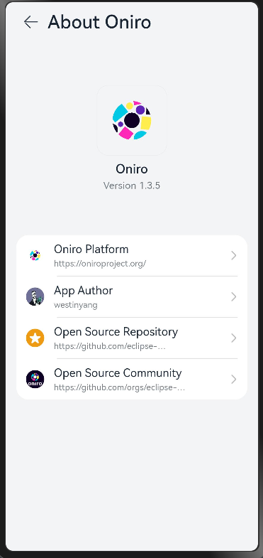

# F-OH

## Project Introduction

> For technical consultation, please go here：[About Author](https://kaihongpai.feishu.cn/wiki/CqWLwJRadibxztkrIWZcogWxnXd)

F-OH is an application center for the Oniro and OpenHarmony platform, and provides download and installation support

The original intention of creating F-OH, both in terms of name and vision, was inspired by [F-Droid](https://f-droid.org). Perhaps OpenHarmony carries too much of everyone's expectations for domestic operating systems and ecosystems. Let us take practical actions to jointly maintain and drive F-OH through the open source community to fulfill its mission!

In fact, the author thought of giving him a Chinese name called "自由开鸿", which fits the meaning of F-OH very well, but maybe the author am too persistent and obsessed with the original idea, and he don't want to change it for the time being.

[Open source repository](https://github.com/eclipse-oniro4openharmony/f-oh/tree/oniro)

[Open source community](https://github.com/orgs/eclipse-oniro4openharmony/repositories)

### Series Projects

- [F-OH Data](https://github.com/eclipse-oniro4openharmony/f-oh-data) `Metadata for all applications on F-OH`
- [F-OH Server](F-OH-Server.md) `F-OH Server，Providing interface services、Platform management, etc. (to be developed）`
- [F-OH Website](F-OH-Web.md) `F-OH website, including documents, blogs, featured applications, etc. (to be developed)`

### Derivative Projects

- [F-OH Web](https://gitee.com/ohos-dev/F-OH-Web)
`The front-end and back-end integrated F-OH Web version is implemented using Bootstrap + Flask, and provides interface, application upload and management functions. It is currently mainly maintained by @myyauyau`
- [F-OH PWA](https://gitee.com/ohos-dev/F-OH-PWA) `A third-party PWA version of F-OH, and provides a Tauri-based client, currently maintained by @Jesse205`

## ~~Submit Applications~~

>F-OH only includes free and open source software. "Free software must be open source, but open source software is not necessarily free. Some open source licenses are too harsh on users, so they are not listed as free software." Quoting the answer written by Richard Stallman, founder of Free GNU and FSF: [Why does open source miss the point of free software?](https://www.gnu.org/philosophy/open-source-misses-the-point.zh-cn.html)

> In the early stages of development, in order to minimize the investment costs of backend development and servers, we temporarily used our own Git service to collaborate and manage the application metadata.

- [F-OH Data](https://github.com/eclipse-oniro4openharmony/f-oh-data)
- ~~This is where the metadata of all F-OH applications is stored. Developers can submit their own applications here.~~
- ~~Open this repository link and follow the instructions to submit your application (very simple)~~

## Functionaility List

Client
- [x] Home page layout
- [x] App games (list and status synchronization)
- [x] App operations (download, install, open)
- [x] Settings page
- [x] About page
- [x] App updates
- [x] Adapt to immersive status bar and navigation bar
- [x] Clear cache
- [x] App details (simple implementation, jump to open source repository)
- [x] App details (complete implementation)
- [ ] Enrich home page
- [ ] App search
- [ ] Download management
- [ ] App management
- [ ] App metadata source management

Server

- [x] Simple application metadata source
- [ ] Complete backend management system

## Development Environment

- DevEco Studio 4.1 Release
- SDK API11 4.1 Release (Full-SDK)

## Compatibility Testing

- We tested it on OpenHarmony developer phone based on OpenHarmony 4.1 Release
- There is no standard system development board, so the horizontal screen, resolution and other issues cannot be debugged and optimized for the time being.

## Deployment Tutorial

- Pull the [F-OH Data](https://github.com/eclipse-oniro4openharmony/f-oh-data) repository to your local computer, enter this directory, and start a static resource server
- Modify the client source code `entry/src/main/ets/data/DataSource.ets` line 24 `ds_server` to point to your static resource server address
- Recompile

## Screenshot preview

## Video Demonstration

- [F-OH: OpenHarmony free and open source software application market is finally born ~ unprecedented ~](https://www.bilibili.com/video/BV1dM411N7CG)
- [F-OH OpenHarmony App Market V1.1: Updated apps, immersive status bar, new icons](https://www.bilibili.com/video/BV1ig4y1u7dD)
- [F-OH OpenHarmony App Market V1.2: built-in browser, clear cache, lots of updates and compatibility optimizations](https://www.bilibili.com/video/BV1LP411S79y)
- [F-OH OpenHarmony App Market V1.3: Added app details, you can view developer information and more](https://www.bilibili.com/video/BV1Th4y1Z7sm)

## License Statement

- This project is open source under the GPLv3 license. You can download it under the terms of the Free Software Foundation[GNU General Public License](https://www.gnu.org/licenses/gpl.html)'s term to make modification and/or redistribution.
- Bottom icon source: https://gitee.com/openharmony/applications_app_samples
- Other icons from: https://www.flaticon.com/packs/basic-user-interface-147

## Sponsorship

- The author is an independent developer, F-OH and some open source projects are his hobbies
- ~~F-OH's metadata server is currently self-purchased and self-built, with low configuration and unstable~~
- ~~Your sponsorship support will be the driving force of F-OH's operation! (Not limited to development boards, servers, etc.)~~
- ~~For sponsorship, please contact us privately or scan the QR code below (please note "F-OH" for the sponsorship fee or send me a private message so that it can be counted in the sponsorship list below）~~

## Sponsorship List

| Index  | Sponsors                                          | Sponsorship Type | Sponsored content              | Sponsorship time       |
|-----|----------------------------------------------|------|-------------------|------------|
| 1   | A*y                                          | cost   | ￥6.66             | 2023-06-21 |
| 2   | A*J                                          | cost   | ￥10               | 2023-07-07 |
| 3   | *阳                                           | cost   | ￥100              | 2023-08-08 |
| 4   | 原*y                                          | cost   | ￥23.33            | 2023-08-15 |
| 5   | [鸿蒙坚果派](https://space.bilibili.com/480883651) | device   | Development board WuyiFH SEEK100 | 2023-08-19 |
| 6   | [深圳晶凌达](http://szjld.net)                    | device   | Development board JLD-A08       | 2023-08-25 |
| 7   | l*n                                          | cost   | ￥8.88             | 2023-08-27 |
| 8   | *凯                                        | cost   | ￥6.66             | 2023-09-01 |
| 9   | 乌拉大喵喵                                        | cost   | ￥50                | 2023-09-04 |
| 10  | *具                                           | cost   | ￥10                | 2023-09-16 |
| 11  | *拉                                           | cost   | ￥10                | 2023-10-24 |
| 12  | *鸣                                           | cost   | ￥6.66              | 2023-11-18 |
| 13  | *G                                           | cost   | ￥9.99              | 2023-11-28 |
| 14  | k*m                                           | cost   | ￥10              | 2023-12-17 |