# AppStore API 11

This document presents the issues encountered when building an API9-based Oniro App Store.

This document used Deveco Studio 4.1 API version 11

1. [fonts Occur Error](#fonts-occur-error)
2. [Syntax Adaptation: `globalThis` cannot be used with `windowStage`](#syntax-adaptation-globalthis-cannot-be-used-with-windowstage)  
3. [Resource to String Conversion](#resource-to-string-conversion)  
4. [ArkTS-no-definite-assignment](#arkts-no-definite-assignment)  
5. [main_pages.json Pages must have a unique entry](#main_pagesjson-pages-must-have-a-unique-entry)  
6. [Syntax Adaptation: `globalThis` cannot be used with `abilityContext.filesDir`](#syntax-adaptation-globalthis-cannot-be-used-with-abilitycontextfilesdir)  
7. [Syntax Adaptation: `for...in` cannot be used](#syntax-adaptation-forin-cannot-be-used)  
   - [First new issue (ArkTS traversing object arrays)](#first-new-issue-arkts-traversing-object-arrays)  
   - [Second new issue (Indexed access is not supported for fields)](#second-new-issue-indexed-access-is-not-supported-for-fields)  
8. [Object.assign error](#objectassign-error)  
9. [Error with non-identifier object property names](#error-with-non-identifier-object-property-names)  
10. [`.catch(err)` error](#catcherr-error)  
11. [Router parameter reception error](#router-parameter-reception-error)  

Issues found during real device testing

1. [Web component cannot be rendered with parameters](#web-component-cannot-be-rendered-with-parameters)  
2. [Server data cannot be rendered](#server-data-cannot-be-rendered)  
3. [App cannot implement installation and download](#app-cannot-implement-installation-and-download)  
4. [Need to get the server HTTP code for UI decision](#need-to-get-the-server-http-code-for-ui-decision)

New project development requirements

1. [Need buffering component and connection failure page during webpage loading](#need-buffering-component-and-connection-failure-page-during-webpage-loading)  
2. [Implement pull-to-refresh](#implement-pull-to-refresh)  
3. [Map local server to public network for debugging](#map-local-server-to-public-network-for-debugging)
4. [Add application start animation](#add-application-start-animation)
5. [Add UI when can't connect to server](#add-ui-when-cannot-connect-to-server)


## fonts Occur Error

```
> hvigor ERROR: Error occurred when ark compiling for previewer: ArkTS:ERROR File: C:/Users/c84381641/DevEcoStudioProjects/appStore_sample/entry/src/main/font/fonts.ets:4:15
 Object literal must correspond to some explicitly declared class or interface (arkts-no-untyped-obj-literals)
```

#### Error Analyze

In the `fonts.ets` file, an object literal with an unspecified type was used.(object literal)

ArkTS requires all object literals to correspond to an explicitly declared class or interface to ensure **type safety**.

```typescript
//define fonts as lists of objects
const fonts = {
  semi_bold: {
    familyName: "SemiBold",
    familySrc: "/font/PlusJakartaSans-semiBold.ttf",
  },
  bold: {
    familyName: "Bold",
    familySrc: "/font/PlusJakartaSans-Bold.ttf",
  },
  medium: {
    familyName: "Medium",
    familySrc: "/font/PlusJakartaSans-Medium.ttf",
  },
  light: {
    familyName: "Light",
    familySrc: "/font/PlusJakartaSans-Light.ttf",
  },
  regular: {
    familyName: "Regular",
    familySrc: "/font/PlusJakartaSans-Regular.ttf",
  },
  extraBold: {
    familyName: "ExtraBold",
    familySrc: "/font/PlusJakartaSans-ExtraBold.ttf",
  },
  italic: {
    familyName: "Italic",
    familySrc: "/font/PlusJakartaSans-Italic.ttf",
  },
};

export default fonts;
```

#### Solution

Define the interface for the `fonts` object

```typescript
// 定义 Font 接口
interface Font {
  familyName: string;
  familySrc: string;
}

// 定义具体的 Fonts 对象类型
interface Fonts {
  semi_bold: Font;
  bold: Font;
  medium: Font;
  light: Font;
  regular: Font;
  extraBold: Font;
  italic: Font;
}

// 定义 fonts 对象
const fonts: Fonts = {
  semi_bold: {
    familyName: "SemiBold",
    familySrc: "/font/PlusJakartaSans-semiBold.ttf",
  },
  bold: {
    familyName: "Bold",
    familySrc: "/font/PlusJakartaSans-Bold.ttf",
  },
  medium: {
    familyName: "Medium",
    familySrc: "/font/PlusJakartaSans-Medium.ttf",
  },
  light: {
    familyName: "Light",
    familySrc: "/font/PlusJakartaSans-Light.ttf",
  },
  regular: {
    familyName: "Regular",
    familySrc: "/font/PlusJakartaSans-Regular.ttf",
  },
  extraBold: {
    familyName: "ExtraBold",
    familySrc: "/font/PlusJakartaSans-ExtraBold.ttf",
  },
  italic: {
    familyName: "Italic",
    familySrc: "/font/PlusJakartaSans-Italic.ttf",
  },
};

export default fonts;
```

> **Note** In ArkTS, indexed signatures are not supported.  
> Therefore, syntax like [key: string]: Font (in the example below) cannot be used to define an object type

```typescript
// 定义 Fonts 对象的接口
interface Fonts {
  [key: string]: Font; // 允许有任意数量的字体，键为字符串，值为 Font 类型
}
```

> To avoid using indexed signatures, you can explicitly define the type for each font.

```typescript
// 定义具体的 Fonts 对象类型
interface Fonts {
  semi_bold: Font;
  bold: Font;
  medium: Font;
  light: Font;
  regular: Font;
  extraBold: Font;
  italic: Font;
}
```

## Syntax Adaptation Globalthis Cannot Be Used With Windowstage

#### Error Message

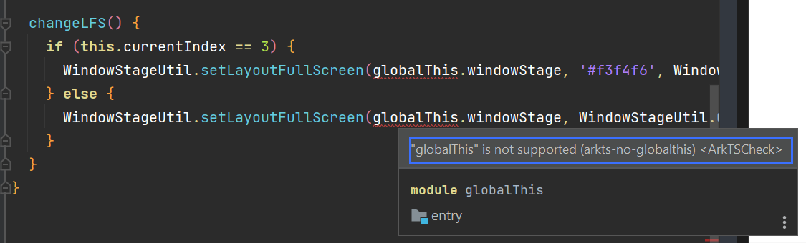

#### References

https://forums.openharmony.cn/forum.php?mod=viewthread&tid=1601

https://segmentfault.com/q/1010000045214058

Since static types cannot be added to `globalThis`, properties of `globalThis` can only be accessed through lookup, leading to additional performance overhead. Additionally, types cannot be assigned to `globalThis` properties, which makes it impossible to ensure safe and high-performance operations on these properties. Therefore, ArkTS does not support `globalThis`.

It is recommended to implement data transfer across different modules according to business logic using the import/export syntax.

If necessary, the functionality of a global object can be achieved by constructing a singleton object. (**Note:** Singleton objects cannot be defined in `har`, as `har` will package two copies in different `hap`s during packaging, making it impossible to achieve a true singleton.)
#### Solution

##### Step 1

Store `windowStage` in a global UI variable within `entryability`.

> Currently, `windowStage` only exists in `onWindowStageCreate`. To access it, use `AppStorage`.

```typescript
  onWindowStageCreate(windowStage: window.WindowStage): void {
    // Main window is created, set main page for this ability
    hilog.info(0x0000, 'testTag', '%{public}s', 'Ability onWindowStageCreate');

    windowStage.loadContent('pages/Index', (err) => {
      if (err.code) {
        hilog.error(0x0000, 'testTag', 'Failed to load the content. Cause: %{public}s', JSON.stringify(err) ?? '');
        return;
      }

       AppStorage.setOrCreate("windowStage", windowStage);

      hilog.info(0x0000, 'testTag', 'Succeeded in loading the content.');
    });
  }
```

##### Step 2

In the `changeLFS` function, retrieve `windowStage` using the `AppStorage.get` method.

```typescript
  changeLFS() {
    // 从 AppStorage 获取 windowStage 实例
    const windowStage = AppStorage.get<window.WindowStage>("windowStage");

    if (!windowStage) {
      console.error("windowStage is not available in AppStorage.");
      return;
    }

    if (this.currentIndex == 3) {
      WindowStageUtil.setLayoutFullScreen(windowStage, '#f3f4f6', WindowStageUtil.COLOR_BLACK, '#f7f7f7', WindowStageUtil.COLOR_BLACK);
    } else {
      WindowStageUtil.setLayoutFullScreen(windowStage, WindowStageUtil.COLOR_WHITE, WindowStageUtil.COLOR_BLACK, '#f7f7f7', WindowStageUtil.COLOR_BLACK);
    }
  }
```

#### Subsequent verification

The logs indicate that `windowStage` cannot be retrieved from `AppStorage`. It is suspected that this might be due to the absence of a simulator or physical device.

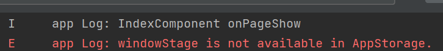

## resource To String Conversion

#### Error Message

The input parameters of certain components do not support the `Resource` type.
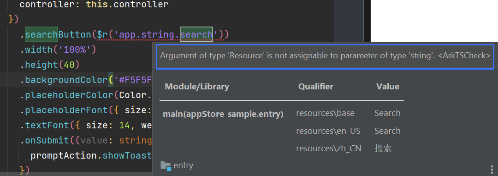

#### Solution

##### Step 1

Wrap the `ResourceToString` method within the component.

```typescript
  ResourceToString(resource:Resource):string{
   return getContext(this).resourceManager.getStringSync(resource)
  }
```

##### Step 2

Call it directly where needed.

```typescript
Search().searchButton(this.ResourceToString($r("app.string.search")));
```

### Reference

**How to convert the Resource type to string in ArkTS:**
https://blog.csdn.net/gsrkuang/article/details/136773584?spm=1001.2101.3001.6650.2&utm_medium=distribute.pc_relevant.none-task-blog-2%7Edefault%7EBlogCommendFromBaidu%7ERate-2-136773584-blog-134664276.235%5Ev43%5Epc_blog_bottom_relevance_base2&depth_1-utm_source=distribute.pc_relevant.none-task-blog-2%7Edefault%7EBlogCommendFromBaidu%7ERate-2-136773584-blog-134664276.235%5Ev43%5Epc_blog_bottom_relevance_base2&utm_relevant_index=5

#### Subsequent verification

Some functions are implemented as mocks and require verification on a real device.
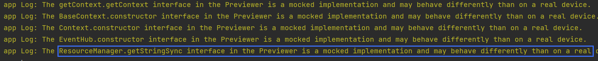

## ArkTS-no-definite-assignment

#### Error Information

When compiling ArkTS, there are some warnings, such as the `!` syntax in variable definitions, which generates warnings.
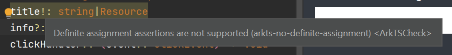

#### Solution

The official solution is to initialize variables either at the time of definition or in the constructor. However, some object types are Interface or type, and it's recommended to initialize these with null. When using them, a null check is required.

Example of initializing an object type with null:

```typescript
private applicationContext: common.ApplicationContext|null=null;
private uiAbilityContext: common.UIAbilityContext|null=null;
private uiContext: UIContext|null=null;
private windowStage: window.WindowStage|null=null;
```

For the issue of having too many null checks, there is currently no optimization solution. The additional null checks are for safety reasons; missing a null check may lead to crashes later.

The current warning specifications cannot be configured to suppress these warnings.

### References

**ArkTS Warning Handling Best Implementation**:
https://segmentfault.com/q/1010000045206935

## main_pages.json Pages Must Have A Unique Entry

#### Error Message

Each page declared in `model_json.ets` must have one and only one entry decorator. 
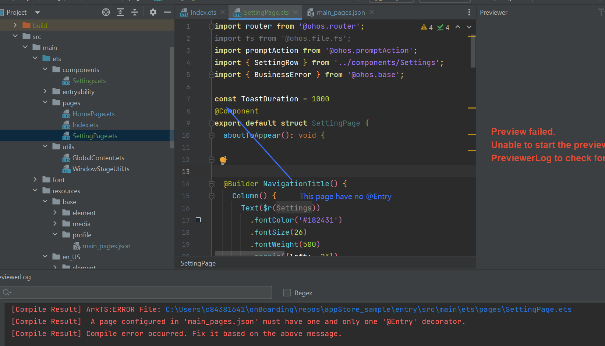

#### Solution

##### Step 1

Remove unnecessary entry pages in the `main_json.ets` file.

In the example below, remove `"pages/SettingPage"`
```typescript
{
  "src": [
    "pages/Index",
    "pages/HomePage",
    "pages/SettingPage"
  ]
}
```

##### Step 2

Ensure that there is no `@Entry` decorator in `SettingPage`.

### Reference

https://segmentfault.com/q/1010000045049039

## Syntax Adaptation: `globalThis` cannot be used with `abilityContext.filesDir`

#### Error Message

Similar to Problem 4 above, `globalThis` cannot be used.

#### Solution

The usage location of the `AppStorage` method varies.

##### Step 1

Store `filesDir` in the `EntryAbility.ets` file.

```typescript
export default class EntryAbility extends UIAbility {
  onCreate(want: Want, launchParam: AbilityConstant.LaunchParam): void {
    hilog.info(0x0000, 'testTag', '%{public}s', 'Ability onCreate');
    let filesDir = this.context.filesDir;
    AppStorage.setOrCreate("filesDir", filesDir);
  }
  ···
}
```

##### Step 2

Declare the `filesDir` variable in the required method and store the data from `AppStorage` in it, then use it where needed.

```typescript
  clearCache() {
    // 从 AppStorage 获取 filesDir 数据
    const filesDir = AppStorage.get<string>("filesDir");

    try {
      promptAction.showDialog({
        title: $r('app.string.confirm_clear_cache'),
        message: $r('app.string.clear_cache_warning'),
        buttons: [
          { text: $r('app.string.cancel'), color: '#000000', },
          { text:$r('app.string.confirm'), color: '#3478f6', }
        ],
      }).then(data => {
        console.info('showDialog success, click button: ' + data.index);

        if (data.index == 1) {
          // 下载路径 /data/storage/el2/base/haps/entry/files
          let dirPath = filesDir;
        }
      }
    }
  }
```

## Syntax Adaptation: `for...in` cannot be used

#### Error Message

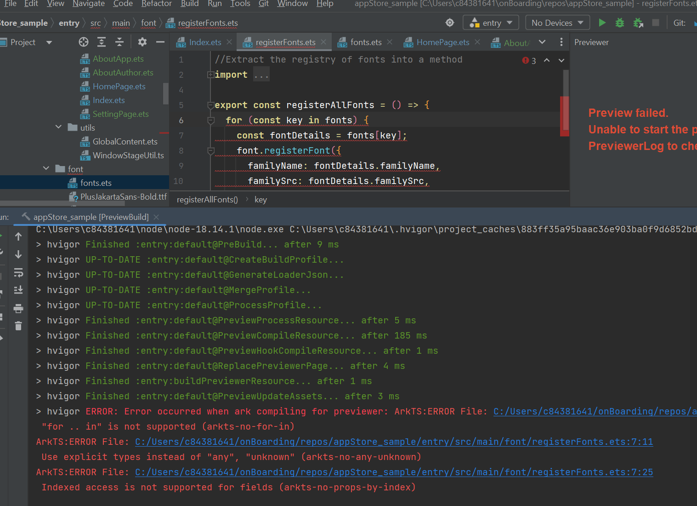

#### Solve 'for...in' not compatible problem

In ArkTS, object layouts are fixed at compile time and cannot be changed at runtime, so using `for...in` to iterate over an object's properties is not supported. For arrays, you can use a regular `for` loop.

- Typescript

```typescript
let a: string[] = ["1.0", "2.0", "3.0"];
for (let i in a) {
  console.log(a[i]);
}
```

- ArkTS

```typescript
let a: string[] = ["1.0", "2.0", "3.0"];
for (let i = 0; i < a.length; ++i) {
  console.log(a[i]);
}
```

#### First new issue (ArkTS traversing object arrays)

Since `fonts` in the project is defined as an object rather than an array, a for loop cannot be used to iterate over it.
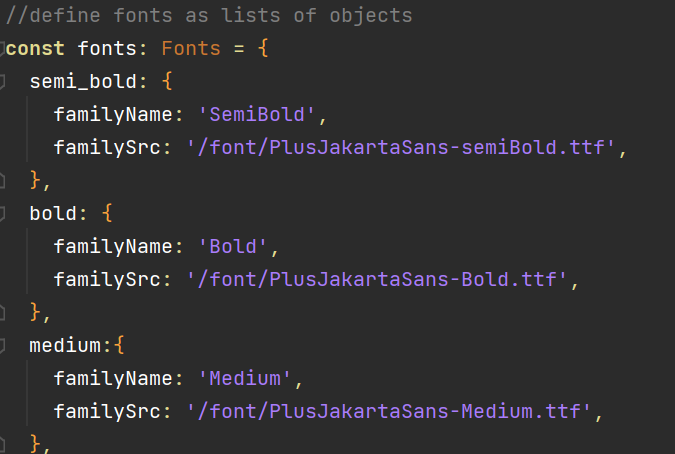

#### Solution

To iterate over objects of types like `object` and `Record`, you can use the `Object.keys()` method to get all properties of the object and then iterate over them.

##### For instance

```typescript
const obj = { a: 1, b: 2, c: 3 };

Object.keys(obj).forEach((key) => {
  console.log(key, obj[key]);
});
```

##### Before modification

```typescript
export const registerAllFonts = () => {
  for (const key in fonts) {
    const fontDetails = fonts[key];
    font.registerFont({
      familyName: fontDetails.familyName,
      familySrc: fontDetails.familySrc,
    });
  }
};
```

##### After modification

```typescript
export const registerAllFonts = () => {
  Object.keys(fonts).forEach((key) => {
    const fontDetails: Font = fonts[key];
    // 注册字体
    font.registerFont({
      familyName: fontDetails.familyName,
      familySrc: fontDetails.familySrc,
    });
  });
};
```

#### Second new issue (Indexed access is not supported for fields)

After preliminary code modifications, an error is still reported. The information is as follows: 
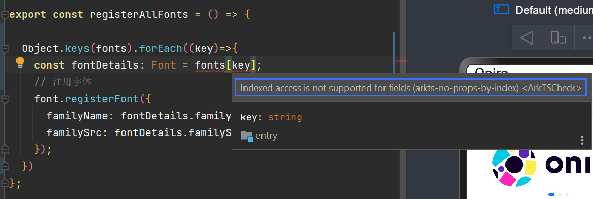

The same issue also appeared in `AppInfo.ets`.

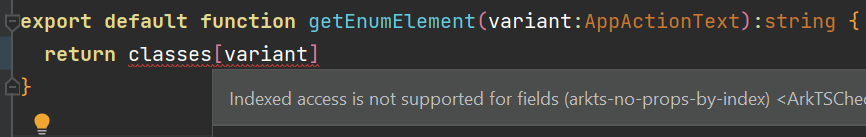

##### Solution

We can use `Object(item)[key]` or `JSON.parse(JSON.stringify(item))[key]`

##### Final Code

I took ` Object(item)[key]`

```typescript
export const registerAllFonts = () => {
  Object.keys(fonts).forEach((key) => {
    const fontDetails: Font = Object(fonts)[key];
    // 注册字体
    font.registerFont({
      familyName: fontDetails.familyName,
      familySrc: fontDetails.familySrc,
    });
  });
};
```

#### References

ArkTS does not support the following adaptation rules for `for...in`:
https://ost.51cto.com/posts/29738

How to iterate over objects in ArkTS:
https://segmentfault.com/q/1010000044602257

Error issue when accessing object values:
https://blog.csdn.net/qq_54418719/article/details/140772066?spm=1001.2101.3001.6650.2&utm_medium=distribute.pc_relevant.none-task-blog-2%7Edefault%7ECTRLIST%7ECtr-2-140772066-blog-135171005.235%5Ev43%5Epc_blog_bottom_relevance_base2&depth_1-utm_source=distribute.pc_relevant.none-task-blog-2%7Edefault%7ECTRLIST%7ECtr-2-140772066-blog-135171005.235%5Ev43%5Epc_blog_bottom_relevance_base2&utm_relevant_index=5

## Object.assign error

#### Error Message

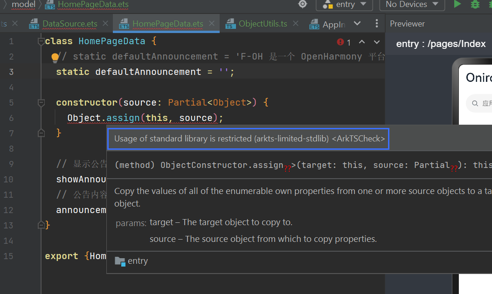

#### Solution

Wrap a utility class in a `.ts` file, then import and use it in an `.ets` file. (Replace the original file with a `.ts` file, then import it in the `.ets` file.)

```typescript
export class ObjectUtils {
  /**
   *对象合并
   *@param target 目标对象
   *@param source 源对象
   *@return 合并后的对象
   **/
  static assign(target: Object, source?: Object): Object {
    return Object.assign(target, source);
  }
}
```

#### New Problem

New problem after importing `ObjectUtils`
A variable of type `Partial<Object>` cannot be used as an object type.
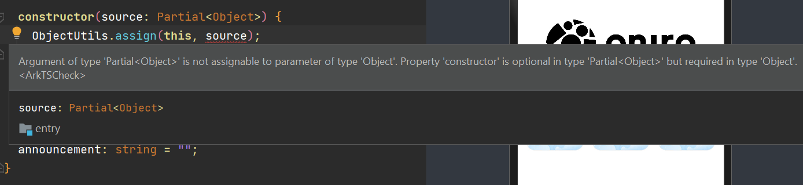

##### Solution

Using `as` performing a type assertion (type casting).

```typescript
import { ObjectUtils } from "../utils/ObjectUtils";

class HomePageData {
  static defaultAnnouncement = "";
  constructor(source: Partial<Object>) {
    ObjectUtils.assign(this, source as Object);
  }
  // 显示公告
  showAnnouncement: boolean = true;
  // 公告内容
  announcement: string = "";
}
export { HomePageData };
```

#### References

HarmonyOS Object.assign\(target, source\)报错问题：
https://segmentfault.com/q/1010000045208468

Argument of type partial is not assignable to parameter of type:
https://stackoverflow.com/questions/63507831/argument-of-type-partial-is-not-assignable-to-parameter-of-type

## Error with non-identifier object property names

#### Error Message

There are 2 error messages：

- arkts-no-untyped-obj-literals：Object literals must correspond to an explicitly declared class or interface.
- arkts-identifiers-as-prop-names：Object property names must be identifiers and cannot be non-identifier strings.

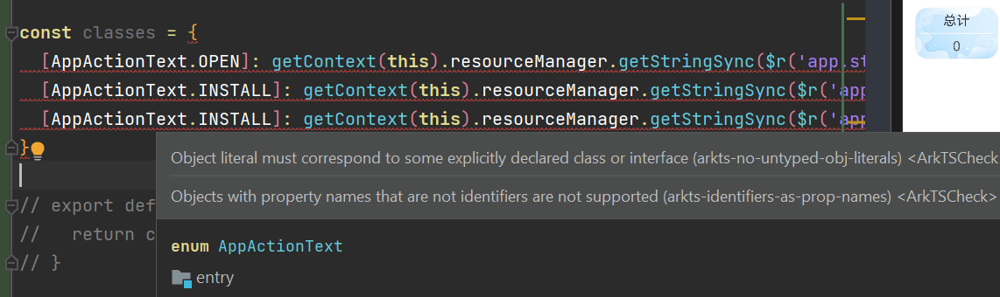

#### Solution

The `arkts-identifiers-as-prop-names` rule in ArkTSCheck does not allow object property names to use non-identifiers (such as Chinese characters, spaces, etc.). Since the `AppActionText` enum values contain Chinese characters, directly using them as object keys triggers this rule.

The solution I used is to create a mapping type that converts the enum values into identifier-friendly English keys.

##### Step 1

Define `ActionTextMap` interface to replace an object literal type

```typescript
interface ActionTextMap {
  open: AppActionText;
  install: AppActionText;
  update: AppActionText;
}
```

##### Step 2

Using `ActionTextMap` interface declaration `actionTextMap` Object

```typescript
const actionTextMap: ActionTextMap = {
  open: AppActionText.OPEN,
  install: AppActionText.INSTALL,
  update: AppActionText.UPDATE,
};
```

##### Step 3

Define `classes` object，using friend key

```typescript
const classes: AppActionClasses = {
  open: getContext(this).resourceManager.getStringSync($r("app.string.open")),
  install: getContext(this).resourceManager.getStringSync(
    $r("app.string.install")
  ),
  update: getContext(this).resourceManager.getStringSync(
    $r("app.string.update")
  ),
};
```

#### References

https://blog.csdn.net/yuanlaile/article/details/139123015

https://segmentfault.com/a/1190000044588922

## `.catch(err)` error

#### Error Message

arkts-no-any-unknown

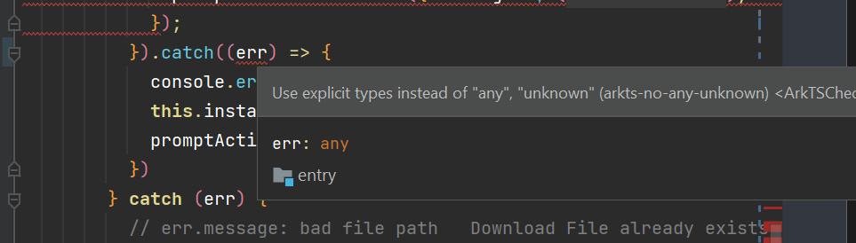

#### Solution

There are variables that are not explicitly typed, commonly seen in try-catch blocks, such as the err variable. You can declare it as `BusinessError`.

```typescript
import { BusinessError } from '@ohos.base';

...

, (err: BusinessError) => {
  console.error(`startApplication promise error: ${JSON.stringify(err)}`);
  promptAction.showToast({ message: $r('app.string.open_failed_app_not_found'), duration: ToastDuration });
};
```

#### References

https://blog.csdn.net/lz8362/article/details/135171005

## Router parameter reception error

#### Error Message

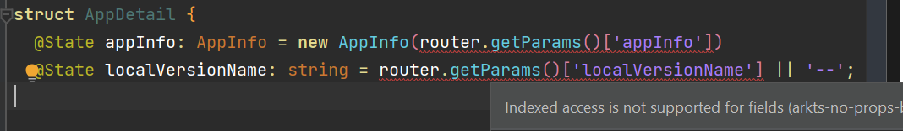
The list of parameters passed to the page via the route is as follows:

```typescript
router.pushUrl({
  url: "pages/AppDetail",
  params: { appInfo: this.appInfo, localVersionName: this.versionCode },
});
```

#### Solution

##### Step 1

Custom interface type

```typescript
interface RouterParams {
  appInfo?: AppInfo;
  localVersionName?: string;
}
```

##### Step 2

use the `as Type` syntax to cast the parameters to a specific type.

```typescript
const params = router.getParams() as RouterParams;
this.appInfo = new AppInfo(params.appInfo);
this.localVersionName = params.localVersionName;
```

#### References

https://docs.openharmony.cn/pages/v4.1/zh-cn/application-dev/ui/arkts-routing.md

## Web component cannot be rendered with parameters

#### Case Background

The `Web` component created cannot dynamically render parameters in the initialization.

```typescript
Web({ src: this.url, controller: this.controller }); //这里的src如果我们传入具体的url字符串则可以渲染网页
```

#### Solution

Use the controller's `loadUrl` interface to change the displayed page of this Web component.

```typescript
import webview from "@ohos.web.webview";
//初始化Web控制器
controller: webview.WebviewController = new webview.WebviewController();
```

```typescript
// 在Web组件的onControllerAttached回调函数中调用
Web({ src: this.url, controller: this.controller }).onControllerAttached(() => {
  this.controller.loadUrl(this.url);
});
```

#### Reference

https://docs.openharmony.cn/pages/v4.1/zh-cn/application-dev/web/web-page-loading-with-web-components.md

## Server data cannot be rendered

#### Case Situation

The local server can render in the previewer but not on the real device because the real device is not connected to the remote server over the network. You need to connect to the local server via `ssh` and then run the `docker` command.

```typescript
docker run -d -p 5000:5000 gowokegobroke/oniro-data:latest
```

This way, all devices can connect to the server, ensuring that the real device is connected to the network.

## Need buffering component and connection failure page during webpage loading

###  buffering component

- Define state variable `isLoading`

```typescript
  @State isLoading: boolean = false
```

- Conditional judgement `isLoading` whether to render the buffering animation based on the state.

```typescript
  if (this.isLoading) {
    Column() {
      LoadingProgress()
        .color(Color.Blue)
        .width(50)
        .margin({ bottom: '10%' })
    }
    .height('100%')
    .justifyContent(FlexAlign.Center)
  }
```

- Render the buffering animation before the page appears.

```typescript
  //执行其build()函数之前执行
  aboutToAppear() {
    this.isLoading = true
  }
```

- Hide the buffering animation when the Web component starts rendering.

```typescript
Web({ src: this.url, controller: this.controller }).onPageBegin((event) => {
  this.isLoading = false;
});
```

### Add Connection Failure UI Page

- Define state variable `isHttpError`

```typescript
@State isHttpError: boolean = false
```

- Define no internet component

```typescript
if (this.isHttpError) {
  Column() {
    Column(){

    Image($r('app.media.ic_no_wifi'))
      .width('20%')
      .opacity(0.4)
    Text("Seems you don't have Internet")
      .opacity(0.4)
      .margin(5)
    Button('Reload')
      .fontColor(Color.Black)
      .backgroundColor(Color.Orange)
      .height('5%')
      .width('35%')
      .type(ButtonType.Normal)
      .fontSize(14)
      .borderRadius(5)
      .fontWeight(FontWeight.Medium)
      .opacity(0.6)
      .onClick(() => {
        // todo: Get code
      })
      .margin(10)
    }
    .margin({
      bottom: '10%'
    })
  }
  .height('100%')
  .justifyContent(FlexAlign.Center)
}
```

- in Web component `onErrorReceive` control the state variable within properties.

```typescript
.onErrorReceive((event)=>{
  if(event){
    this.isHttpError = true
  }
})
```

#### References

LoadingProgress:  
https://blog.csdn.net/qq_58213084/article/details/138597035
onErrorReceive:  
https://docs.openharmony.cn/pages/v5.0/zh-cn/application-dev/reference/apis-arkweb/ts-basic-components-web.md

## Implement pull-to-refresh

#### Attention

If there is a button for the refresh functionality, you must call `this.controller.refresh()` and `this.controller.pushUrl()` within the onclick callback function to trigger the `refresh` and `update` the URL accordingly.

#### Problem

The Refresh component can implement pull-to-refresh functionality, but if the only component inside it is a `Web` component, it may fail due to the `Web` component's rendering behavior or lifecycle issues related to the refresh interaction.

#### Explaination

The issue where the `Web` component does not support pull-to-refresh typically relates to the native behavior of the component and the framework’s support for such interactions. Since the Web component is a standalone view, it does not natively support interactive refresh behaviors like those from the Refresh component. Embedded browser views, by default, do not respond to gestures or pull-to-refresh actions from their parent container.

#### Substitution solution

Adding `Button` component to manually trigger a refresh event through a button click

```typescript
Stack() {
  // 页面标题
  Navigation()
    .title(this.NavigationTitle())
    .hideToolBar(true)
    .height(56)
    .width('100%')
    .titleMode(NavigationTitleMode.Mini)
    .hideBackButton(false)

  Button() {
    Image($r('app.media.ic_refresh'))
      .height(30)
      .width(30)
  }
  .zIndex(1)
  .fontColor(Color.Black)
  .backgroundColor(Color.White)
  .height('5%')
  .type(ButtonType.Circle)
  .fontWeight(FontWeight.Medium)
  .opacity(0.8)
  .margin({
    right: 15
  })
  .onClick(() => {
    try {
      this.isLoading = true
      this.controller.refresh();
      this.controller.loadUrl(this.url)
    } catch (error) {
      hilog.error(0x0, `ErrorCode: ${(error as BusinessError).code}`, `Message: ${(error as BusinessError).message}`);
    }
  })
}
.alignContent(Alignment.End)
```

#### References

https://docs.openharmony.cn/pages/v5.0/zh-cn/application-dev/reference/apis-arkweb/js-apis-webview.md#refresh

## App cannot implement installation and download

#### Problem Description

In the app store project, click the install button to show a popup window `202 - permission denied, non-system app called system api. arkts`

#### Problem Analyze

App is normal app，can't call system API

#### Solution

In the application signature file, set the application as a system app by setting the `app-feature` field to `hos_system_app`.

In `OpenHarmony\Sdk\11\toolchains\lib\UnsgnedReleasedProfileTemplate.json` change application level into `hos_system_app`

```typescript
	"bundle-info":{
    ...
		"apl":"system_core",
		"app-feature":"hos_system_app"
	},
```
> **Attention:**
If it's invalid after changing the level, try to automaticlly generate the signing file
#### Reference

https://developer.huawei.com/consumer/cn/doc/harmonyos-guides-V3/ohos-auto-configuring-signature-information-0000001271659465-V3#section42735161005

## Map local server to public network for debugging

#### Usage background
During real device testing, you need to map the local server to the public network so that the mobile device can render data from the server.
#### Solution

Using `ngrok`, following the tutorial is fine

https://dashboard.ngrok.com/get-started/setup/windows

## Need to get the server HTTP code for UI decision

#### Requirement Background

The app store needs a UI interface to display the situation when server data cannot be retrieved.

#### Solution

In `DataSource` make an aync `http` code function

```typescript
async fetchHttpCode(): Promise<number> {
  try {
    let httpRequest = http.createHttp();
    const response = await new Promise<number>((resolve, reject) => {
      httpRequest.request(ds_server, (err: Error, data: http.HttpResponse) => {
        if (!err) {
          resolve(data.responseCode);
        } else {
          reject(err);
        }
      });
    });
    return response; // 返回响应码
  } catch (error) {
    console.error('Error fetching HTTP code:', error);
    return -1; // 返回一个错误码
  }
}
```

In `aboutToAppear` component call `fetchHttopCode` get the status code and assign it to the UI variable defined on the page for use.

```typescript
aboutToAppear() {
  const source = new DataSource()
  source.fetchHttpCode().then((code) => {
    this.res = code; // 更新状态变量以触发 UI 的重新渲染
    if (code == 200) {
      DataSource.getAppList(this.appType, (data: AppInfo[]) => {
        this.appList = data;
      })
    }
  });
}
```

## Add application start animation
```typescript
import router from '@ohos.router';

@Entry
@Component
struct SplashPage {
  @State flag: boolean = false;

  onPageShow(): void {
    animateTo({
      duration: 2000,
      onFinish:()=>{
        //when the animation finish go the main page
        setTimeout(()=>{
          router.replaceUrl({url: 'pages/Index'})
        }, 200)
      }
    }, () => {
      this.flag = true
    })
  }

  build() {
    Column() {
      if (this.flag) {
        Image($r('app.media.ONIRO'))
          .logoStyle()
          .transition({
            type: TransitionType.Insert,
            opacity: 0,
            translate: { x: -150 },
            scale:{
              x:5,
              y:5
            }
          })
        Text($r('app.string.oniro_appStore'))
          .titleStyle()
          .transition({
            type: TransitionType.Insert,
            opacity: 0,
            translate: { x: 150 }
          })
      }
      Blank()
    }
    .bgStyle()
  }
}

@Extend(Image)
function logoStyle() {
  .width(90)
  .height(90)
  .margin({ top: 120 })
}

@Extend(Text)
function titleStyle() {
  .fontSize(21)
  .fontColor(Color.Black)
  .fontWeight(FontWeight.Bold)
  .margin({ top: 15 })
}

@Styles
function bgStyle() {
  .width('100%')
  .height('100%')
  .backgroundColor(Color.White)
  .backgroundImageSize({ width: '100%', height: '100%' })
}

@Extend(Text)
function footerStyle() {
  .fontSize(12)
  .fontColor('#ff7ba416')
  .fontWeight(FontWeight.Bold)
  .margin({ bottom: 30 })
}
```
## Add UI when cannot connect to server
